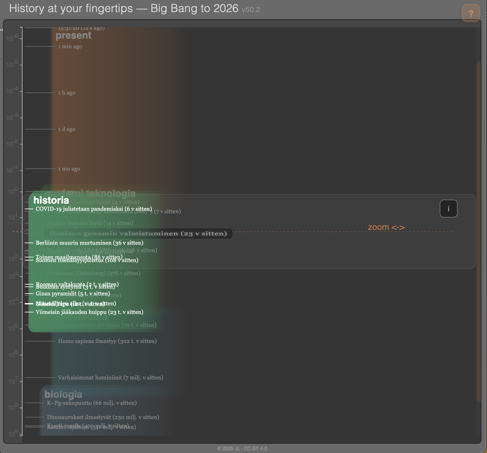
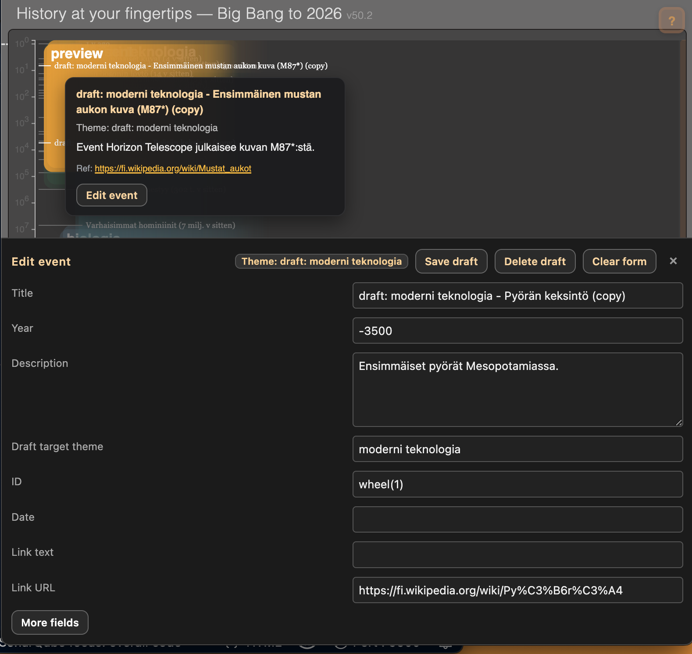
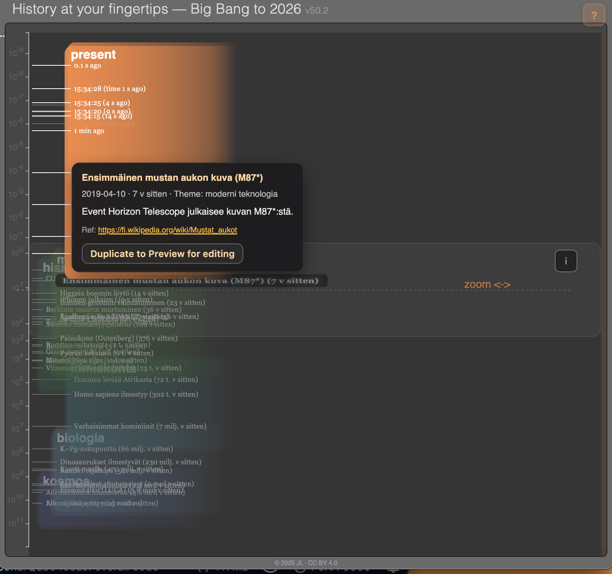

# Timescale-project
Meta repository for the **Logarithmic Timeline Visualization Project (2025)**

## Overview
This project explores interactive visualizations of history across vast time spans, from the **Big Bang** to the **present day**.  
It uses a **vertical logarithmic scale** to make both cosmic and human timescales visible in a single view.

- **Cosmic timeline:** Big Bang → galaxies → solar system → life  
- **Human timeline:** human evolution → civilizations → modern technology  
- **Interactive features:** zooming, theme cards, tooltips, event filters  

The visualization is implemented with **HTML, CSS, JavaScript (D3.js)** and can run in any modern browser.  
All data is stored in a **JSON event database** (`eventsDB.json`).

## Goals
- Provide an **intuitive sense of scale** across 13.8 billion years.  
- Enable anyone to **experiment with their own themes** using the JSON editor.  
- Support **mobile-friendly browsing** and interactive exploration.  
- Maintain a clear version history for incremental improvements.
  
## Working Repositories
- [log-aikajana](https://github.com/JukkaTLinjama/log-aikajana) – versions **v1–32**, single-file HTML prototypes  
- [log-aikajana-v33](https://github.com/JukkaTLinjama/log-aikajana-v33) – versions **v33+**, modular structure with external CSS/JS/JSON
-  https://github.com/JukkaTLinjama/timescale_dev -- versions **v43 to v50**

⚠️ **Note:** The working code and event data are currently written in **Finnish** (labels, comments, UI strings).  
English translation and localization are planned for future versions.

## Structure
- `index.html` – current main entry point (v33+ architecture)  
- `style.css` – visual design  
- `timeline.js` – timeline rendering and zoom logic  
- `eventsDB.json` – structured event database  
- `log aikajana v7.html … v32` – earlier single-file prototypes  
- `log aikajana v33+` – modular structure with external CSS/JS/JSON

### Example: Event Database Structure
<pre style="font-size:12px; line-height:1.3; background:#1e1e1e; color:#ddd; padding:6px 8px; border-radius:4px;">
{
  "metadata": { "version": "1.6", "author": "JL", "updated": "2025-08-04" },
  "events": [
    {
      "theme": "cosmos",
      "events": [
        { "label": "Big Bang", "year": "13.8 billion", "time_years": 13800000000, "log": 17.64, "comments": "" },
        { "label": "First stars", "year": "13.2 billion", "time_years": 13200000000, "log": 17.52 }
      ]
    }
  ]
}
</pre>

## Version History
- **v1–32:** Single-file HTML prototypes.  
- **v33+:** Modular structure (`index.html` + external CSS/JS + `eventsDB.json`).  
- **v35:** Improved zoom bar, better layering, mobile support.

## Present Version 43 Update

See [readmev43.md](./readmev43.md) for the current architecture overview,  
metadata-based rendering, and upcoming roadmap (inline editor + realtime theme).

See also the original [README.md of log-aikajana (v1–32)](https://github.com/JukkaTLinjama/log-aikajana/blob/main/README.md).

## Live Demos
- v32 demo: [GitHub Pages](https://jukkatlinjama.github.io/log-aikajana/)  

## Editor & Event Database
An accompanying **event editor** is being developed to make it easier to create and modify events in `eventsDB.json`.  
The goal is that **anyone can try their own themes and visualize them** directly in the timeline.

## License
Shared as an **open experiment** under [Creative Commons BY 4.0](https://creativecommons.org/licenses/by/4.0/).  
Enjoy, use, and share!

---

## Current Development Status (v50.2)

Since the last documented architecture update (**v43**), the project has evolved into a more clearly structured system with strict separation between:

- **data preparation**
- **pure rendering**
- **editor / workflow tooling**

The timeline renderer (`timeline.js`) is now a *pure, deterministic renderer* that does not load or mutate data.  
All editing, preview, and commit workflows are handled outside the renderer.

A concise architectural status description is available here:

👉 **[Development Status Since v43](./assets/Development_Status_v43_v50.md)**

---

### Screenshots (v50.2)

Below are screenshots illustrating the current state of the system:

#### Main timeline view

#### Preview & editor workflow

#### Present mode & info overlay

---

**Status summary**

- Stable mobile behavior
- Data-driven prefocus (no DOM feedback loops)
- Explicit layer model with active-card overlay
- Preview → draft → commit workflow operational
- Renderer fully decoupled from editor logic
